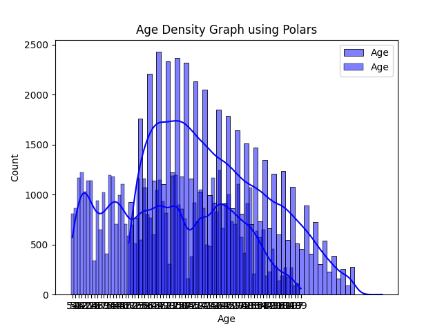

Describe_pandas:
                age          year
count  53285.000000  53474.000000
mean      45.631285   1991.954894
std       17.472393     10.948351
min       18.000000   1973.000000
25%       31.000000   1983.000000
50%       43.000000   1993.000000
75%       59.000000   2002.000000
max       99.000000   2010.000000

Describe_polars:
shape: (9, 13)
┌─────────────┬─────────┬─────────────┬───────┬───┬─────────────┬────────────┬────────┬────────────┐
│ describe    ┆ region  ┆ income      ┆ happy ┆ … ┆ wrkstat     ┆ partyid    ┆ sex    ┆ year       │
│ ---         ┆ ---     ┆ ---         ┆ ---   ┆   ┆ ---         ┆ ---        ┆ ---    ┆ ---        │
│ str         ┆ str     ┆ str         ┆ str   ┆   ┆ str         ┆ str        ┆ str    ┆ f64        │
╞═════════════╪═════════╪═════════════╪═══════╪═══╪═════════════╪════════════╪════════╪════════════╡
│ count       ┆ 53474   ┆ 53474       ┆ 53474 ┆ … ┆ 53474       ┆ 53474      ┆ 53474  ┆ 53474.0    │
│ null_count  ┆ 0       ┆ 0           ┆ 0     ┆ … ┆ 0           ┆ 0          ┆ 0      ┆ 0.0        │
│ mean        ┆ null    ┆ null        ┆ null  ┆ … ┆ null        ┆ null       ┆ null   ┆ 1991.95489 │
│             ┆         ┆             ┆       ┆   ┆             ┆            ┆        ┆ 4          │
│ std         ┆ null    ┆ null        ┆ null  ┆ … ┆ null        ┆ null       ┆ null   ┆ 10.948351  │
│ min         ┆ E. NOR. ┆ $1000 TO    ┆ DK    ┆ … ┆ KEEPING     ┆ IND NEAR   ┆ FEMALE ┆ 1973.0     │
│             ┆ CENTRAL ┆ 2999        ┆       ┆   ┆ HOUSE       ┆ DEM        ┆        ┆            │
│ 25%         ┆ null    ┆ null        ┆ null  ┆ … ┆ null        ┆ null       ┆ null   ┆ 1983.0     │
│ 50%         ┆ null    ┆ null        ┆ null  ┆ … ┆ null        ┆ null       ┆ null   ┆ 1993.0     │
│ 75%         ┆ null    ┆ null        ┆ null  ┆ … ┆ null        ┆ null       ┆ null   ┆ 2002.0     │
│ max         ┆ W. SOU. ┆ REFUSED     ┆ VERY  ┆ … ┆ WORKING     ┆ STRONG     ┆ MALE   ┆ 2010.0     │
│             ┆ CENTRAL ┆             ┆ HAPPY ┆   ┆ PARTTIME    ┆ REPUBLICAN ┆        ┆            │
└─────────────┴─────────┴─────────────┴───────┴───┴─────────────┴────────────┴────────┴────────────┘

